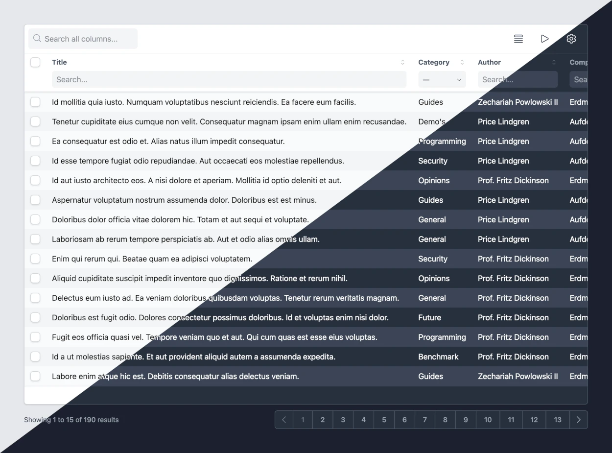

# Livewire Tables

[](https://github.com/ramonrietdijk/livewire-tables/actions/workflows/tests.yml)
[](LICENSE.md)
[](https://packagist.org/packages/ramonrietdijk/livewire-tables)

Easily create dynamic tables for models with Laravel Livewire.



If you enjoy using this package, please consider leaving a star.

## Demo

See the [Livewire Table](https://livewire-tables.ramonrietdijk.nl) in action.

## Documentation

Open the [documentation](https://ramonrietdijk.github.io/livewire-tables) to see how this package can be used with
examples.

## Testing

To make sure everything works, run the following command:

```sh
composer quality
```

## Credits

- [Ramon Rietdijk](https://github.com/ramonrietdijk)
- [All Contributors](../../contributors)

## License

This package is released under the [MIT](LICENSE.md) license.
